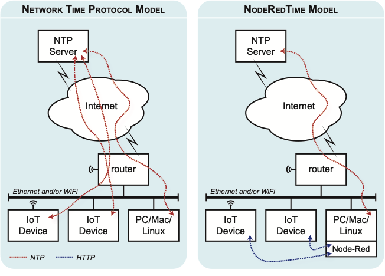

# NodeRedTime library (ESP32 & ESP8266)

NodeRedTime is an Arduino library to fetch Unix Epoch timestamps from Node-Red. It is an alternative to NTP. It is intended for use where a Node-Red server and a collection of IoT devices share the same local area network. It has particular application for IoT devices using deep-sleep to conserve battery power.

> Acknowledgement: This library was inspired by Andreas Spiess' [NTP Time example](https://github.com/SensorsIot/NTP-time-for-ESP8266-and-ESP32).

## Use Case

Given the way the worldwide network of [NTP time servers](https://www.ntppool.org/) underpins so much of the Internet, the protocol could hardly be said to be either unreliable or particularly difficult to use. But NTP is not without its [special requirements](https://insights.sei.cmu.edu/sei_blog/2017/04/best-practices-for-ntp-services.html), [traps](https://en.wikipedia.org/wiki/NTP_server_misuse_and_abuse) and [pitfalls](https://www.linkedin.com/pulse/how-use-ntp-pool-heiko-gerstung). In particular:

* NTP typically requires repeated calls before a valid timestamp is obtained. For IoT clients, this means WiFi has to be kept active for arbitrarily long periods. That can be undesirable when running on battery.
* NTP sometimes fails to answer within a reasonable period (eg 10 seconds). This can add design complexity if an IoT client depends on waking from deep sleep and checking the wallclock time before performing an important function.
 
Most environments with a complement of IoT devices will already contain computers running Linux, macOS or Windows, and there is an increasing chance that one of those computers will be running Node-Red. Those computers usually synchronise their clocks via NTP and can be considered *credible* when it comes to knowing the current wallclock time.

A Raspberry Pi running Graham Garner's **excellent** [IOTstack](https://github.com/SensorsIot/IOTstack) is a perfect example of a low-cost, mains-powered, always-on, server-class computer running Node-Red that already gets its time from NTP.

It is certainly possible to implement NTP relay functions on a local computer and have IoT devices synchronise locally via NTP. This library offers an alternative model, based on HTTP and Node-Red, which may be simpler for the average user to implement:



Whether you decide to stick to NTP or adopt this library will depend upon your exact needs. Issues to consider include:

* NTP pool servers already exist and require no setup or maintenance effort on your part. NodeRedTime depends on the availability of a Node-Red server so, if you have don't have one already, you will have to get one. The process isn't difficult, particularly if you deploy a Rasperry Pi 4 running [IOTstack](https://github.com/SensorsIot/IOTstack), but don't underestimate the learning-curve.
* NTP pool servers are high-availability with lots of redundancy. A single in-house Node-Red server is only as reliable as you can make it. Think about occasional reboots (eg during routine maintenance) and how tolerant your IoT devices will be of small outages. Do you have a lot of mains power interruptions in your area? Do you have an Uninterruptible Power Supply (UPS) to ride through those? Keep in mind that you will lose communication with NTP too if your router isn't protected by a UPS!
* Communicating with NTP servers depends on everything between you and the server working: your router, your ISP's equipment, multiple router hops as your packets traverse the Internet, services like the DNS, and wildcards like DDoS attacks. Outages are _rare_ but not _unknown_. Communicating with a local Node-Red server usually involves fewer devices and fewer hops, and you probably aren't going to suffer a DDoS attack *inside* your home network.
* Establishing time synchronisation with an NTP pool server requires iteration and _sometimes_ that can't be achieved within a reasonable interval, even if pool servers are reachable. Providing it is reachable, a local Node-Red server is pretty much guaranteed to provide a response to an IoT device, every single time it asks.
* Debugging NTP problems can be a bit of a black art. Debugging Node-Red problems can be as easy as attaching "Debug" nodes to a flow and watching the output.
* Minimising your network footprint (by reducing the load on NTP pool servers in favour of this library) is one way to be a [good Netizen](https://en.wikipedia.org/wiki/Netizen).

## Configuring your Node-Red time service

### Get system time from an appropriate NTP pool (optional)

It is usually a good idea to make sure that your Node-Red host is getting its time from NTP pool servers that are close to you, geographically. You will find instructions for doing that [here](https://gist.github.com/Paraphraser/e1129880015203c29f5e1376c6ca4a08).

> Although the instructions are Raspbian-specific, the basic process will be similar on other platforms.

### Define a Node-Red flow

* Launch your browser and connect to your Node-Red server.
* Use the main menu (three horizontal bars "≡" at the top, right of the Node-Red window) to open the [Palette Manager](https://nodered.org/docs/user-guide/runtime/adding-nodes), select the "Install" tab, then search for and install [node-red-contrib-moment](https://flows.nodered.org/node/node-red-contrib-moment). If you prefer to install contributions from the command line, do that.
* Back in the main window, click the "+" button to create a new empty flow. The default title will be something like "Flow 1". Double-click the title and rename the flow with a name like "Time". The actual name is not important.
* Select everything in the box below and copy it to the clipboard:

```
[
    {
        "id": "1195d9bd.77dda6",
        "type": "tab",
        "label": "Flow 2",
        "disabled": false,
        "info": ""
    },
    {
        "id": "f2c93568.0ca918",
        "type": "moment",
        "z": "1195d9bd.77dda6",
        "name": "Return Unix Epoch Milliseconds (UTC)",
        "topic": "",
        "input": "",
        "inputType": "date",
        "inTz": "",
        "adjAmount": 0,
        "adjType": "days",
        "adjDir": "add",
        "format": "x",
        "locale": "",
        "output": "",
        "outputType": "msg",
        "outTz": "",
        "x": 410,
        "y": 140,
        "wires": [
            [
                "fff3bdf7.72186"
            ]
        ]
    },
    {
        "id": "fff3bdf7.72186",
        "type": "http response",
        "z": "1195d9bd.77dda6",
        "name": "http reply",
        "statusCode": "",
        "headers": {},
        "x": 640,
        "y": 140,
        "wires": []
    },
    {
        "id": "c194f3e3.6c9178",
        "type": "http in",
        "z": "1195d9bd.77dda6",
        "name": "[Get] /time",
        "url": "/time",
        "method": "get",
        "upload": false,
        "swaggerDoc": "",
        "x": 180,
        "y": 140,
        "wires": [
            [
                "f2c93568.0ca918"
            ]
        ]
    }
]
```

* Open the Node-Red main menu ("≡") and choose "Import". A text-insertion cursor will be blinking in the coloured area. Paste the clipboard contents into the coloured area. The default option is to import into the current flow (which is what you want) so just click the "Import" button.
* A three-node flow will be attached to your mouse pointer. Click once anywhere on the canvas to place the flow. The result should look like this:


* Click "Deploy".

The flow is simple and should work "as is". Working from left to right:

* "HTTP in" node configured with the "GET" method to listen to the URL-suffix "/time".
* "Moment" node (installed by *node-red-contrib-moment*) configured to return *output format* "x" (Unix timestamp in milliseconds).
* "HTTP response" node that transmits a string representation of the Unix epoch milliseconds value back to the requesting host.

> Allowable values for the "moment" node *output format* field are [documented here](https://momentjs.com/docs/#/displaying/format/).

## Test your Node-Red time service

Use the template below to construct a URL:

```
http://«host»:1880/time/
```

Considerations:

* The «host» field can be either a domain name or the IP address of your Node-Red server. You _may_ also be able to use a multicast DNS name like "raspberrypi.local" if your Node-Red server advertises and responds to such a name.
* Node-Red's default port is 1880. If your Node-Red server is using a different port, you will need to substitute that here.
* The "/time/" suffix comes from the URL field of the "HTTP in" node discussed earlier. If you change the "HTTP in" node, you will have to make a matching change here. The suffix will work as either "/time" or "/time/". The latter form is generally considered best practice.

Paste the URL into the URL bar of your **browser** and press return. You should expect a response like this:

```
1575958717695
```  

That value in milliseconds corresponds with "2019-12-10T06:18:37.695Z". The answer you get will be different but it should still be recognizable as a simple integer of similar magnitude. Check your work if you do not get the expected result.

## And now, the Arduino side of things

Full documentation for the NodeRedTime API is provided in the "extras" directory. This is a high-level overview. The API has two main calls:

* *serverTime()* — _always_ asks Node-Red for the time. In other words, this will _always_ involve the setup and teardown overheads of an HTTP transaction (~ 9 packets).
* *syntheticTime()* — calls *serverTime()* on your behalf, but if and only if:
	* *serverTime()* has not been called previously, either by *syntheticTime()* or by an explicit call to *serverTime()* elsewhere in your sketch; **or**
	* whenever the millis() clock wraps back to zero every 49.7 days; **or**
	* whenever a timeout expires. The timeout defaults to 1 hour but can be changed by passing an optional argument to the NodeRedTime constructor.
	
	otherwise, *syntheticTime()* calculates updated wallclock time by adding milliseconds-elapsed since the last call to *serverTime()*.
	
Most sketches should simply call *syntheticTime()* and leave the details of when to call *serverTime()* to the API.

*syntheticTime()* is intended as a direct replacement for the *time()* function from time.h, which behaves like this:

* The first call to *time()* fetches wallclock seconds from NTP.
* Subsequent calls to *time()* update the seconds value without making additional calls to NTP, until the API needs to resynchronise with NTP (eg every hour).

> You may be asking, "If *syntheticTime()* and *time()* have the same basic behaviour, why bother with *syntheticTime()* at all?" Because, if your Arduino project wakes, obtains the time, does something based on the time of day, then goes back to sleep, *syntheticTime()* will use significantly less battery, overall, than *time()*. Even if conserving battery energy is not a concern, *syntheticTime()* will generally provide an answer with less variability than *time()* so the overall behaviour of your sketch will be more predictable.

### Code snippets

The library includes an example sketch called NodeRedTime. This section summarises the key steps.

Step 1. Include the NodeRedTime library:

```
#include <NodeRedTime.h>
```

Step 2. Instantiate an instance of the NodeRedTime class. This should usually be somewhere near the top of your sketch, before your setup() and loop() functions:

```
NodeRedTime nodeRedTime("http://my-node-red-host.my-domain.com:1880/time/");
```

> The same considerations as explained earlier ("Test your Node-Red service") apply, save that multicast DNS names like "raspberrypi.local" will not work out-of-the-box on ESP32 boards.

In a similar location in your sketch, define your time-zone string. This is an example for Australia/Sydney:

```
const char* TZ_INFO    = "AEST-10AEDT,M10.1.0,M4.1.0/3";
```

> The example NodeRedTime sketch explains in detail how to find the time-zone string for your location, and how to interpret time-zone strings.

Step 3. In your setup() function, apply your time-zone string:

```
// inform time.h of the rules for local time conversion
setenv("TZ", TZ_INFO, 1);
```

> "TZ" is a required key. The third parameter (1) instructs setenv() to overwrite any previous values.

Step 4. In the body of your code when you need to know the wallclock time:

```
// a variable to hold the seconds value
time_t epochTime;

// fetch wallclock time as a seconds value
bool success = nodeRedTime.syntheticTime(&epochTime);

// could time be obtained?
if (success) {

    // a "tm" structure is used to decompose a seconds
    // value into its component parts (year, month, day, etc)
    tm timeinfo;

    // if you want your local time, use localtime_r()
    if (localtime_r(&epochTime, &timeinfo)) {

        // display in human-readable form
        Serial.printf("local time: %s",asctime(&timeinfo));

    }

    // if you want UTC aka GMT, use gmtime_r()
    if (gmtime_r(&epochTime, &timeinfo)) {

        // display in human-readable form
        Serial.printf("UTC: %s",asctime(&timeinfo));

    }

}
```

> Note: *asctime()* returns a C string with a newline character at the end. The NodeRedTime example sketch shows a different way of displaying time by referencing the individual fields (eg year, month, day) from the *timeinfo* struct.

## Comparison with NTP

Two basic scenarios are considered:

1. An IoT device boots, runs setup() to establish its runtime environment and then enters loop() where it remains more or less indefinitely. This is typical of devices powered from the mains.
2. An IoT device boots and performs most if not all of its work in setup() and then enters deep-sleep for a predetermined period. This is typical of devices powered from battery where conserving power is a key objective.

In the first scenario, there is very little difference between NTP and NodeRedTime. You can expect the first call to NTP to take roughly 90ms, and the first call to NodeRedTime to take about 30ms. Subsequent calls to either API will return almost instantly because the necessary calculations are performed locally and do not involve network traffic.

> The response times you see in practice will depend on many factors including the speed of the processor, the round-trip time from your location to the server, and the server's reaction time.

A sketch involving deep sleep represents a kind of worst-case scenario for both NTP and NodeRedTime. This is because neither API can take a shortcut by computing updated time values based upon a prior value. NTP must always query a pool server and NodeRedTime must always query a Node-Red server.

The table below summarises the results from 100 test cycles of an ESP8266 development board performing the following:

* Boot
* Preamble (establish serial port, connect to WiFi)
* Define timezone and NTP server pool (needed by getNTPTime())
* Call an instrumented version of getNTPTime()
* Call an instrumented version of NodeRedTime.serverTime()
* Enter deep sleep for 60 seconds

> The test sketch is included in the "extras" folder if you want to repeat the test in your own environment.

Metric       |Measure         |NTP |Node-Red |Units
:------------|:--------------:|---:|--------:|:-----
Iterations   |x̄               |9   |1        |iterations per request
Iterations   |σx<sub>n-1</sub>|3   |0        |iterations per request
Response Time|x̄               |94.8|28.8     |milliseconds per request
Response Time|σx<sub>n-1</sub>|29.8|4.8      |milliseconds per request

getNTPTime() iterated an average of 9 times per test cycle with a sample standard deviation of 3 iterations per test cycle.

NodeRedTime.serverTime() does not iterate. This is why its results show a fixed count of 1 with no variability.

Iteration, combined with greater network round trip time, also explains why getNTPTime() has a much higher average response time (94.8 milliseconds) and larger sample standard deviation (29.8 milliseconds) than NodeRedTime.serverTime(). Still, even though the device under test and the Node-Red server were on the same local area network, a mean response time of 28.8 milliseconds and sample standard deviation of 4.8 milliseconds is not particularly "cheap". This is likely explained by HTTP using TCP (~ 9 packets) while NTP relies on UDP (two packets per iteration).

Nevertheless, in the context of battery-powered IoT projects, these results suggest that NodeRedTime would be faster than, and use much less energy than, NTP.
